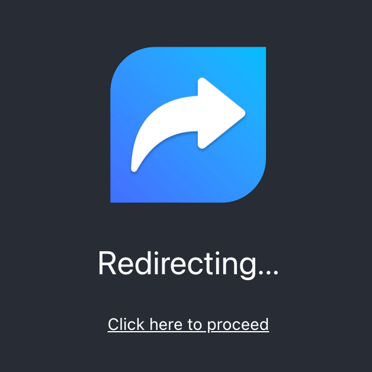

<div align="center">
  
</div>

# Netlify Redirector

This is a simple React app that redirects any domain to another URL via Netlify, including preservation of links, should you want.

It's quick, easy, and painless. It's also highly configurable. Just follow the steps below.

## Demo

The following instance of Netlify Redirector will redirect to `https://github.com/`, and will preserve paths.

[netlify-redirector-demo.netlify.app/justinmahar/netlify-redirector](https://netlify-redirector-demo.netlify.app/justinmahar/netlify-redirector)

[](https://app.netlify.com/sites/netlify-redirector-demo/deploys)

If the redirect is successful, you will be sent to the project repo. This deploy uses all default options, with the preserve path setting switched on.

Feel free to try `netlify-redirector-demo.netlify.app/` with any path after the `/` to demonstrate path preservation.

## Setup

### 1. Deploy To Netlify

First, click this button to start a new deploy of Netlify Redirector:

[](https://app.netlify.com/start/deploy?repository=https://github.com/justinmahar/netlify-redirector)

Alternatively, you can clone a copy of this repo and deploy the repo manually:

<a href="https://github.com/justinmahar/netlify-redirector/generate">
  
</a>

### 2. Set Up Your Redirect

When setting up your Netlify deploy, add an environment variable called `REACT_APP_REDIRECT_URL`, and set it to the URL you'd like to redirect to.

For example:

```
REACT_APP_REDIRECT_URL=https://www.github.com/
```

If you'd like to preserve paths so that links to the old domain still work with the new one, set `REACT_APP_PRESERVE_PATH` to `true`.

See the additional options you can configure [below](#options). 

### 3. Confirm Redirection Is Active

Once the deploy finishes, your redirect will be active.

Visit the Netlify site to confirm the redirect is working as expected. If not, see the troubleshooting guide below.

From here, you can configure the deploy to use your origin domain through Netlify. [Read the instructions on how to set that up here.](https://docs.netlify.com/domains-https/custom-domains/)

## Tips

- **Be sure to redeploy.** You must redeploy your site after setting the environment variables.
- **Redirects are fast.** There is a 3-second delay before the React app is rendered. The redirect will likely happen so quickly that you will not see it.
- **You can reuse the same repo.** You can deploy the same repo as many times as you'd like in Netlify, each with different configured redirect URLs. You don't need a new repo for every redirected domain.
- **You can preserve links if you want.** Set `REACT_APP_PRESERVE_PATH` to `true` if you want links to the old domain to still work.
- **More options below!** Change the colors, text, render delay, and more. See below for all the config options.

## How It Works

The app uses 2 techniques to redirect the user's browser to your target.

1. `meta refresh`: The oldest trick in the book still works. The app uses a `<meta>` refresh tag to redirect the browser. [More info here.](https://developer.mozilla.org/en-US/docs/Web/HTML/Element/meta#refresh)
2. `window.open`: The app will use window.open with a target of `_self` immediately after rendering has completed. [More info here.](https://developer.mozilla.org/en-US/docs/Web/API/Window/open)

If, after 3 seconds, neither of these work, a simple page is displayed with a link to redirect. In most cases, this page will never be seen.

## Options

You can set the following environment variables to modify the behavior and appearance of this application.

| Environment Variable                       | Description                                                                                                                                                                                                                                                                                 |
| ------------------------------------------ | ------------------------------------------------------------------------------------------------------------------------------------------------------------------------------------------------------------------------------------------------------------------------------------------- |
| `REACT_APP_REDIRECT_URL`                   | **Required.** The URL to redirect to.                                                                                                                                                                                                                                                       |
| `REACT_APP_PRESERVE_PATH`                  | Optional. By default, the path is not preserved, so links to content on the old domain won't redirect properly. Set to `true` to preserve the path, which will be appended to the end of your configured URL, and will preserve the links. Just make sure your URL points to the root path. |
| `REACT_APP_AUTOMATIC_REDIRECTION_DISABLED` | Optional. By default, redirection occurs automatically. Set to `true` to disable this behavior.                                                                                                                                                                                             |
| `REACT_APP_DARK_MODE_ENABLED`              | Optional. When `true`, the redirect page will appear in dark mode.                                                                                                                                                                                                                          |
| `REACT_APP_BG_COLOR`                       | Optional. Specify the background color of the redirect page.                                                                                                                                                                                                                                |
| `REACT_APP_FG_COLOR`                       | Optional. Specify the foreground text color of the redirect page.                                                                                                                                                                                                                           |
| `REACT_APP_IMG_DISABLED`                   | Optional. When `true`, the image will not be shown on the redirect page, for a simpler look.                                                                                                                                                                                                |
| `REACT_APP_MESSAGE_TEXT`                   | Optional. Customize the message shown. Default is "Redirecting..."                                                                                                                                                                                                                          |
| `REACT_APP_MESSAGE_DISABLED`               | Optional. When `true`, the message will not be shown on the redirect page.                                                                                                                                                                                                                  |
| `REACT_APP_LINK_TEXT`                      | Optional. Customize the link text. Default is "Click here to proceed"                                                                                                                                                                                                                       |
| `REACT_APP_LINK_DISABLED`                  | Optional. When `true`, the redirect link will not be shown. Not recommended.                                                                                                                                                                                                                |
| `REACT_APP_PAGE_TITLE`                     | Optional. Customize the title of the page.                                                                                                                                                                                                                                                  |
| `REACT_APP_RENDER_DELAY`                   | Optional. By default, the redirect page is not rendered for 3000 milliseconds (3 seconds). You can customize this delay in millis, or set it to 0 for no delay. In most cases, the redirect will occur so quickly that the page will never be shown.                                        |

### How To Preserve Links

Set `REACT_APP_PRESERVE_PATH` to `true` to preserve links to the old domain. 

For example, if your redirect URL is `https://example.com/` and Netlify Redirector is set up at `my-old-domain.com`, then the link `https://my-old-domain.com/profiles/heisenberg` would be redirected to `https://example.com/profiles/heisenberg`.

Without this setting turned on, all links to your old domain would simply redirect to `https://example.com/`.

### Blank Page Only

If you want just a blank page, then set the following environment variables to `true`:

- `REACT_APP_IMG_DISABLED` = `true`
- `REACT_APP_MESSAGE_DISABLED` = `true`
- `REACT_APP_LINK_DISABLED` = `true`

## Troubleshooting

`URIError: Failed to decode param '/%REACT_APP_REDIRECT_URL%'`

If you see this error, the `REACT_APP_REDIRECT_URL` environment variable may have been configured but not deployed yet. Make sure you trigger a new deploy after the variable has been configured. 

---

```
This site can’t be reached
The webpage at https://site-name.netlify.app/%REACT_APP_REDIRECT_URL% might be temporarily down or it may have moved permanently to a new web address.
ERR_HTTP2_PROTOCOL_ERROR
```

If you see this error, the `REACT_APP_REDIRECT_URL` environment variable may have been configured but not deployed yet. Make sure you trigger a new deploy after the variable has been configured. 
